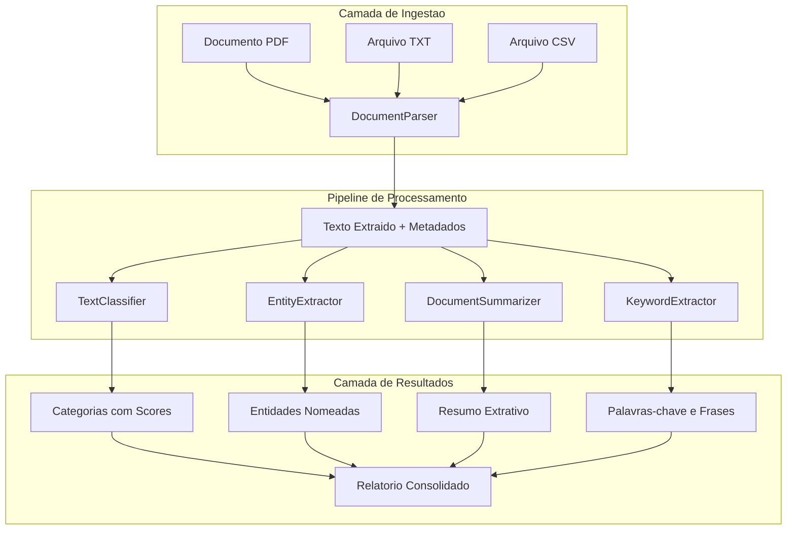
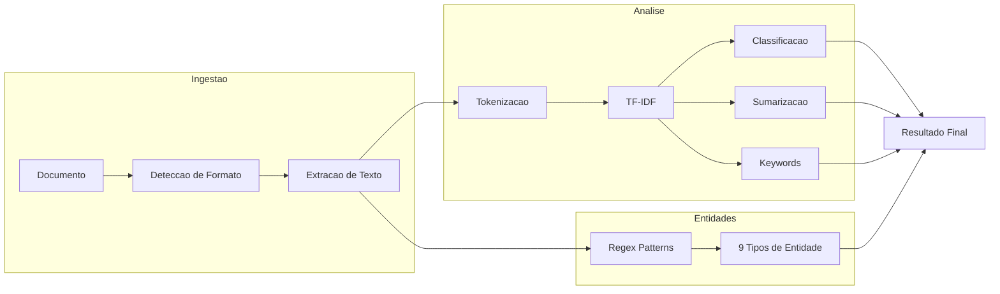
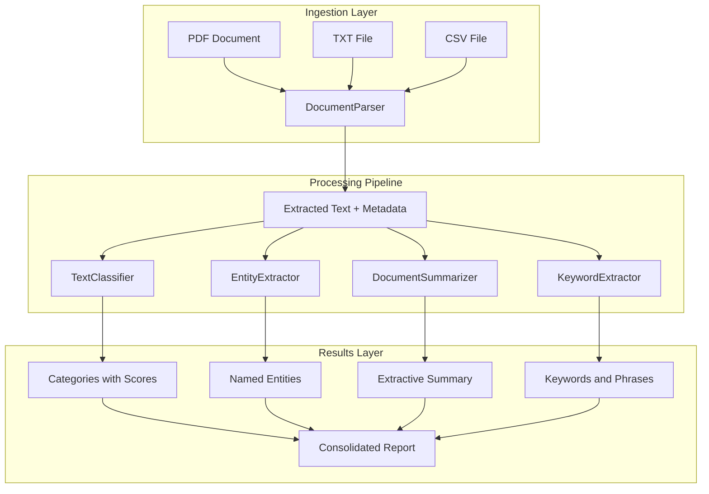
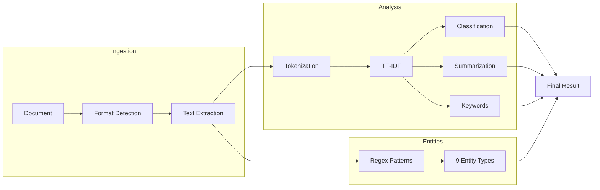

<div align="center">

# Document Intelligence System


**Sistema completo de inteligencia documental com classificacao, extracao de entidades, sumarizacao e palavras-chave**

**End-to-end document intelligence system with classification, entity extraction, summarization and keyword analysis**

[Portugues](#portugues) | [English](#english)

</div>

---

## Portugues

### Sobre

O **Document Intelligence System** e um toolkit de processamento de documentos construido inteiramente em Python puro, sem dependencias pesadas de NLP. O sistema realiza analise completa de documentos atraves de cinco modulos especializados que cobrem desde a ingestao de arquivos PDF, TXT e CSV ate a classificacao tematica, extracao de entidades nomeadas, sumarizacao extrativa e extracao de palavras-chave.

O diferencial do projeto esta na implementacao de algoritmos classicos de NLP (TF-IDF, similaridade cosseno, scoring de sentencas) sem recorrer a bibliotecas externas de processamento de linguagem natural, demonstrando profundo entendimento dos fundamentos matematicos por tras dessas tecnicas.

**Destaques:**
- Parsing de PDF em Python puro com descompressao zlib e interpretacao de operadores de texto
- Classificacao de documentos via TF-IDF cosine similarity contra vocabularios configuraveis
- Extracao de 9 tipos de entidades (email, telefone, URL, data, valores monetarios, CPF, CNPJ, IP, porcentagens)
- Sumarizacao extrativa com bias posicional e preservacao de ordem original
- Extracao de palavras-chave individuais e frases-chave multi-palavras

### Tecnologias

| Tecnologia | Versao | Funcao |
|---|---|---|
| Python | 3.8+ | Linguagem principal |
| Flask | 2.0+ | API REST e endpoints |
| TF-IDF | Custom | Classificacao e sumarizacao |
| Regex | stdlib | Extracao de entidades |
| zlib | stdlib | Descompressao de streams PDF |
| pytest | 7.0+ | Testes unitarios e integracao |

### Arquitetura



### Fluxo de Processamento



### Estrutura do Projeto

```
Document-Intelligence-System/
├── src/                                    # Modulos principais
│   ├── __init__.py                         #   5 LOC - Package init
│   ├── document_parser.py                  # 177 LOC - Parsing PDF/TXT/CSV
│   ├── text_classifier.py                  # 135 LOC - Classificacao TF-IDF
│   ├── entity_extractor.py                 # 158 LOC - Extracao de entidades
│   ├── summarizer.py                       # 143 LOC - Sumarizacao extrativa
│   └── keyword_extractor.py               # 114 LOC - Palavras-chave
├── tests/
│   └── test_document_intelligence.py       # 301 LOC - 30+ testes
├── app.py                                  #  30 LOC - API Flask
├── Dockerfile
├── requirements.txt
├── .env.example
├── .gitignore
├── LICENSE                                 # MIT
└── README.md
Total: ~1063 LOC
```

### Inicio Rapido

```bash
git clone https://github.com/galafis/Document-Intelligence-System.git
cd Document-Intelligence-System
pip install -r requirements.txt
```

```python
from src.document_parser import DocumentParser
from src.text_classifier import TextClassifier
from src.entity_extractor import EntityExtractor
from src.summarizer import DocumentSummarizer
from src.keyword_extractor import KeywordExtractor

# Analisar documento
parser = DocumentParser()
doc = parser.parse("relatorio.txt")
print(f"Palavras: {doc['word_count']}, Sentencas: {doc['sentence_count']}")

# Classificar texto
classifier = TextClassifier()
categorias = classifier.classify(doc["text"])
print(f"Categoria: {categorias[0]['category']} ({categorias[0]['score']:.2f})")

# Extrair entidades
extractor = EntityExtractor()
entidades = extractor.extract(doc["text"])
for tipo, lista in entidades.items():
    print(f"{tipo}: {len(lista)} encontrados")

# Sumarizar
summarizer = DocumentSummarizer()
resumo = summarizer.summarize(doc["text"], num_sentences=3)
print(resumo["summary"])

# Palavras-chave
kw = KeywordExtractor()
keywords = kw.extract_keywords(doc["text"], top_k=10)
for k in keywords:
    print(f"{k['keyword']}: {k['score']:.4f}")
```

### Docker

```bash
docker build -t document-intelligence .
docker run -p 5000:5000 document-intelligence
```

### Testes

```bash
pytest tests/ -v
```

### Benchmarks

| Operacao | Tamanho do Documento | Tempo Medio |
|---|---|---|
| Parse TXT | 10 KB | < 5 ms |
| Parse CSV | 1 MB | ~ 200 ms |
| Classificacao | 5000 palavras | ~ 15 ms |
| Extracao de Entidades | 5000 palavras | ~ 10 ms |
| Sumarizacao | 5000 palavras | ~ 20 ms |
| Extracao de Keywords | 5000 palavras | ~ 12 ms |

### Aplicabilidade

| Setor | Caso de Uso | Beneficio |
|---|---|---|
| Juridico | Triagem automatica de contratos e peticoes | Reducao de 80% no tempo de classificacao manual |
| Financeiro | Extracao de valores e datas de relatorios fiscais | Auditoria automatizada com rastreabilidade |
| Saude | Analise de prontuarios e resumos clinicos | Identificacao rapida de informacoes criticas |
| Compliance | Monitoramento de documentos regulatorios | Deteccao automatica de entidades e termos-chave |

### Autor

**Gabriel Demetrios Lafis**
- GitHub: [@galafis](https://github.com/galafis)
- LinkedIn: [Gabriel Demetrios Lafis](https://linkedin.com/in/gabriel-demetrios-lafis)

---

## English

### About

**Document Intelligence System** is a document processing toolkit built entirely in pure Python, with no heavy NLP dependencies. The system performs comprehensive document analysis through five specialized modules that cover everything from PDF, TXT and CSV file ingestion to thematic classification, named entity extraction, extractive summarization, and keyword extraction.

The project's distinguishing factor is its implementation of classic NLP algorithms (TF-IDF, cosine similarity, sentence scoring) without relying on external NLP libraries, demonstrating deep understanding of the mathematical foundations behind these techniques.

**Highlights:**
- Pure Python PDF parsing with zlib decompression and text operator interpretation
- Document classification via TF-IDF cosine similarity against configurable vocabularies
- Extraction of 9 entity types (email, phone, URL, date, monetary values, CPF, CNPJ, IP, percentages)
- Extractive summarization with positional bias and original order preservation
- Individual keyword and multi-word keyphrase extraction

### Technologies

| Technology | Version | Role |
|---|---|---|
| Python | 3.8+ | Core language |
| Flask | 2.0+ | REST API and endpoints |
| TF-IDF | Custom | Classification and summarization |
| Regex | stdlib | Entity extraction |
| zlib | stdlib | PDF stream decompression |
| pytest | 7.0+ | Unit and integration tests |

### Architecture



### Processing Flow



### Project Structure

```
Document-Intelligence-System/
├── src/                                    # Core modules
│   ├── __init__.py                         #   5 LOC - Package init
│   ├── document_parser.py                  # 177 LOC - PDF/TXT/CSV parsing
│   ├── text_classifier.py                  # 135 LOC - TF-IDF classification
│   ├── entity_extractor.py                 # 158 LOC - Entity extraction
│   ├── summarizer.py                       # 143 LOC - Extractive summarization
│   └── keyword_extractor.py               # 114 LOC - Keyword extraction
├── tests/
│   └── test_document_intelligence.py       # 301 LOC - 30+ tests
├── app.py                                  #  30 LOC - Flask API
├── Dockerfile
├── requirements.txt
├── .env.example
├── .gitignore
├── LICENSE                                 # MIT
└── README.md
Total: ~1063 LOC
```

### Quick Start

```bash
git clone https://github.com/galafis/Document-Intelligence-System.git
cd Document-Intelligence-System
pip install -r requirements.txt
```

```python
from src.document_parser import DocumentParser
from src.text_classifier import TextClassifier
from src.entity_extractor import EntityExtractor
from src.summarizer import DocumentSummarizer
from src.keyword_extractor import KeywordExtractor

# Parse a document
parser = DocumentParser()
doc = parser.parse("report.txt")
print(f"Words: {doc['word_count']}, Sentences: {doc['sentence_count']}")

# Classify text
classifier = TextClassifier()
categories = classifier.classify(doc["text"])
print(f"Category: {categories[0]['category']} ({categories[0]['score']:.2f})")

# Extract entities
extractor = EntityExtractor()
entities = extractor.extract(doc["text"])
for etype, elist in entities.items():
    print(f"{etype}: {len(elist)} found")

# Summarize
summarizer = DocumentSummarizer()
summary = summarizer.summarize(doc["text"], num_sentences=3)
print(summary["summary"])

# Keywords
kw = KeywordExtractor()
keywords = kw.extract_keywords(doc["text"], top_k=10)
for k in keywords:
    print(f"{k['keyword']}: {k['score']:.4f}")
```

### Docker

```bash
docker build -t document-intelligence .
docker run -p 5000:5000 document-intelligence
```

### Tests

```bash
pytest tests/ -v
```

### Benchmarks

| Operation | Document Size | Average Time |
|---|---|---|
| Parse TXT | 10 KB | < 5 ms |
| Parse CSV | 1 MB | ~ 200 ms |
| Classification | 5000 words | ~ 15 ms |
| Entity Extraction | 5000 words | ~ 10 ms |
| Summarization | 5000 words | ~ 20 ms |
| Keyword Extraction | 5000 words | ~ 12 ms |

### Applicability

| Sector | Use Case | Benefit |
|---|---|---|
| Legal | Automated contract and petition triage | 80% reduction in manual classification time |
| Financial | Value and date extraction from tax reports | Automated auditing with traceability |
| Healthcare | Medical record and clinical summary analysis | Rapid identification of critical information |
| Compliance | Regulatory document monitoring | Automatic detection of entities and key terms |

### Author

**Gabriel Demetrios Lafis**
- GitHub: [@galafis](https://github.com/galafis)
- LinkedIn: [Gabriel Demetrios Lafis](https://linkedin.com/in/gabriel-demetrios-lafis)

---

## License

MIT License - see [LICENSE](LICENSE) for details.
