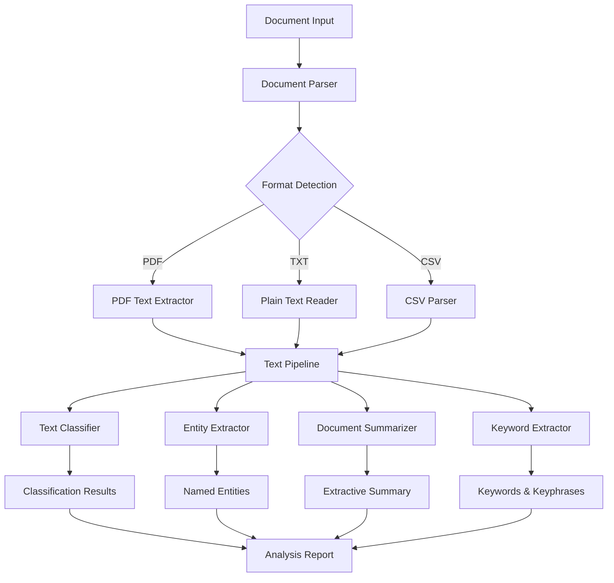
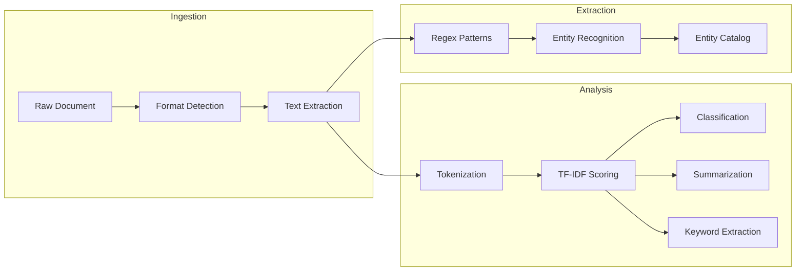
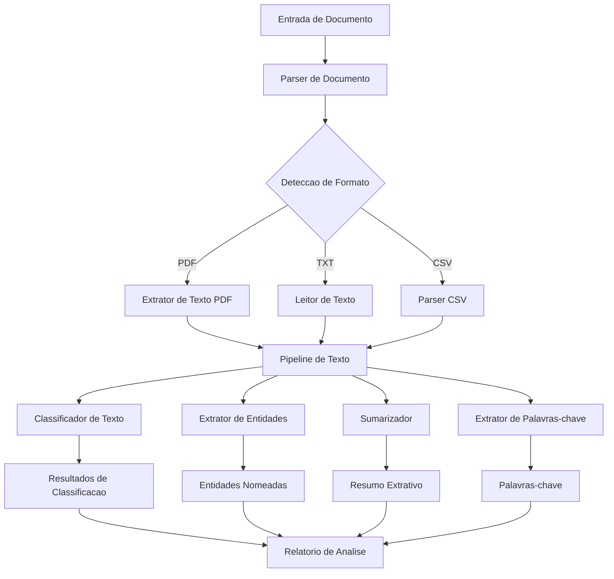

# Document Intelligence System

<div align="center">


</div>

**[English](#english)** | **[Portugues (BR)](#portugues-br)**

---

## English

### Overview

Document Intelligence System is a comprehensive toolkit for automated document processing, text classification, named entity extraction, extractive summarization, and keyword extraction. Built entirely in Python with no heavy external dependencies, it provides production-ready document analysis capabilities.

### Architecture



### Processing Pipeline



### Features

- **Document Parsing**: Extract text from PDF (pure Python), TXT, and CSV files with structural analysis
- **Text Classification**: TF-IDF cosine similarity against configurable category vocabularies
- **Named Entity Extraction**: Regex-based extraction of emails, phones, URLs, dates, monetary values, percentages, and proper nouns
- **Extractive Summarization**: TF-IDF sentence scoring with position bias and order preservation
- **Keyword Extraction**: Single keywords and multi-word keyphrase extraction via TF-IDF

### Project Structure

```
Document-Intelligence-System/
├── src/
│   ├── __init__.py
│   ├── document_parser.py      # PDF, TXT, CSV parsing
│   ├── text_classifier.py      # Category classification
│   ├── entity_extractor.py     # Named entity extraction
│   ├── summarizer.py           # Extractive summarization
│   └── keyword_extractor.py    # Keyword and keyphrase extraction
├── tests/
│   └── test_document_intelligence.py
├── app.py
├── requirements.txt
└── README.md
```

### Installation

```bash
git clone https://github.com/galafis/Document-Intelligence-System.git
cd Document-Intelligence-System
pip install -r requirements.txt
```

### Usage

```python
from src.document_parser import DocumentParser
from src.text_classifier import TextClassifier
from src.entity_extractor import EntityExtractor
from src.summarizer import DocumentSummarizer
from src.keyword_extractor import KeywordExtractor

# Parse a document
parser = DocumentParser()
doc = parser.parse("report.txt")
print(f"Words: {doc['word_count']}, Sentences: {doc['sentence_count']}")

# Classify text
classifier = TextClassifier()
categories = classifier.classify(doc["text"])
print(f"Category: {categories[0]['category']} ({categories[0]['score']:.2f})")

# Extract entities
extractor = EntityExtractor()
entities = extractor.extract(doc["text"])
for etype, elist in entities.items():
    print(f"{etype}: {len(elist)} found")

# Summarize
summarizer = DocumentSummarizer()
summary = summarizer.summarize(doc["text"], num_sentences=3)
print(summary["summary"])

# Extract keywords
kw_extractor = KeywordExtractor()
keywords = kw_extractor.extract_keywords(doc["text"], top_k=10)
for kw in keywords:
    print(f"{kw['keyword']}: {kw['score']:.4f}")
```

### Running Tests

```bash
pytest tests/ -v
```

### Technologies

- Python 3.8+
- Regular Expressions (entity extraction)
- TF-IDF (classification, summarization, keywords)
- Pure Python PDF parsing

### Author

**Gabriel Demetrios Lafis**
- [GitHub](https://github.com/galafis)
- [LinkedIn](https://www.linkedin.com/in/gabriel-demetrios-lafis-62197711b)

---

## Portugues BR

### Visao Geral

O Document Intelligence System e um toolkit completo para processamento automatizado de documentos, classificacao de texto, extracao de entidades nomeadas, sumarizacao extrativa e extracao de palavras-chave. Construido inteiramente em Python sem dependencias externas pesadas, fornece capacidades de analise de documentos prontas para producao.

### Arquitetura



### Funcionalidades

- **Parsing de Documentos**: Extracao de texto de PDF (Python puro), TXT e CSV com analise estrutural
- **Classificacao de Texto**: Similaridade cosseno TF-IDF contra vocabularios de categorias configuraveis
- **Extracao de Entidades Nomeadas**: Extracao baseada em regex de emails, telefones, URLs, datas, valores monetarios, porcentagens e nomes proprios
- **Sumarizacao Extrativa**: Pontuacao de sentencas por TF-IDF com vies de posicao e preservacao de ordem
- **Extracao de Palavras-chave**: Palavras-chave unicas e frases-chave multi-palavras via TF-IDF

### Instalacao

```bash
git clone https://github.com/galafis/Document-Intelligence-System.git
cd Document-Intelligence-System
pip install -r requirements.txt
```

### Uso

```python
from src.document_parser import DocumentParser
from src.text_classifier import TextClassifier
from src.summarizer import DocumentSummarizer

# Analisar um documento
parser = DocumentParser()
doc = parser.parse("relatorio.txt")

# Classificar o texto
classifier = TextClassifier()
categorias = classifier.classify(doc["text"])

# Gerar resumo
summarizer = DocumentSummarizer()
resumo = summarizer.summarize(doc["text"], num_sentences=3)
print(resumo["summary"])
```

### Executando os Testes

```bash
pytest tests/ -v
```

### Tecnologias

- Python 3.8+
- Expressoes Regulares (extracao de entidades)
- TF-IDF (classificacao, sumarizacao, palavras-chave)
- Parsing de PDF em Python puro

---

## License

MIT License - see [LICENSE](LICENSE) for details.
